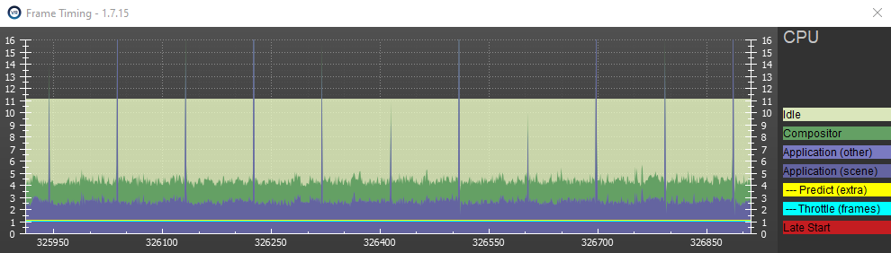
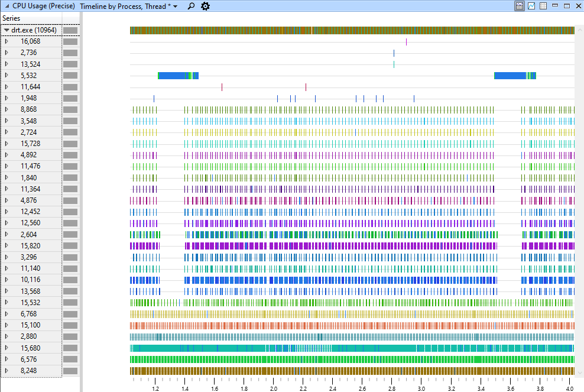
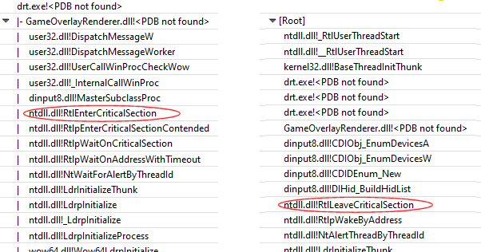

# DirtFix (DiRT Input Glitch Fixer) v1.2

## Introduction

Recent Codemasters "DiRT" series games check for game controller changes every
2 seconds, which can cause a spike in CPU activity, leading to gameplay glitches.
DirtFix suspends this background polling to eliminate the glitches it causes.

Tested with DiRT Rally, DiRT Rally 2.0, and DiRT 4.

## Install

- Download and run the [installer for the latest version](https://github.com/simonowen/dirtfix/releases/latest).
- Select the games to fix (or Add any DiRT game locations that are missing).
- Click OK to apply the settings.
- Launch the DiRT game as normal.

To change settings for a game, re-launch DirtFix from the Start Menu shortcut.
To completely deactivate, uninstall from "Add or Remove Programs".

## Upgrade

To upgrade an earlier version simply over-install with the latest version.

## Results

Before installing, the SteamVR profiler shows CPU activity spikes at ~2 second
intervals that often exceed the 11ms frame time budget for 90fps in VR:

After installing, the CPU spikes are absent, for smoother performance:

## Cause

Below is a 3 second thread activity snapshot from DiRT Rally. It was recorded in
VR after pressing Esc to pause the start of a rally. DirtFix was not installed.

The coloured markers show when each of the ~30 threads are actively executing.
Thread 5532 is the DirectInput polling thread, and the solid blue block shows
it polling for game controller changes using `IDirectInput8!EnumDevices`. The
bulk of this time is spent parsing device INF files in `cfgmg32!ParseNewInf`.
Note that when the input thread is active, most of the other game threads are
not running!

Examining the end of idle gap we can see how long the threads were asleep, and
what ultimately woke them up. In many cases the threads were waiting for each
other, and one of them was waiting for the input thread:

The stack on the left shows the main game thread, which is currently dispatching
windows messages. The DINPUT8 module is hooked into the window procedure as part
of a `IDirectInputDevice8::SetCooperativeLevel` call, and before its processing
it acquires the `DINPUT8!g_crstDll` critical section. This is owned by another
thread, so it goes back to sleep to wait for it.

The stack on the right shows that the input thread owns the critical section
during device enumeration, and it's only released when that completes. This lock
contention is stalling the main game thread processing whenever the input thread
is enumerating devices, which happens every ~2 seconds. This typically leads to
multiple dropped frames.

While DirtFix suspending the input polling does avoid the problem, it would be
better if polling only occurred when PnP notifications indicated a change. This
can be done using `RegisterDeviceNotification` or by handling `WM_DEVICECHANGE`.

## Internals

DirtFix uses a shim version of a DirectInput module (dinput8.dll), which is
copied into the game directory. This allows allows it to sit between the game
and DirectInput API, and change its behaviour.

DirtFix passes through the first 3 calls to `IDirectInput8::EnumDevices` on each
thread, before failing the call. The failure code causes the game to skip any
post-processing of the results, so no further controller changes are seen. This
both saves CPU time and avoids the main thead lock contention, to prevents the
glitches.

Source code is available from the [DirtFix project page](https://github.com/simonowen/dirtfix) on GitHub.
Includes VS2019 solution, but requires detours.lib from vcpkg.

## Changelog

### v1.2
- fixed re-entrant hook crash, possibly related to Logitech drivers.  
  Special thanks to GitHub users digitalmonk1973, br3ndanp, and caerphoto.

### v1.1
- added support for DiRT Rally 2.0 and DiRT 4.
- complete rewritten to avoid using thread injection.

### v1.0
- first public test release.

---

Simon Owen  
https://github.com/simonowen/dirtfix
